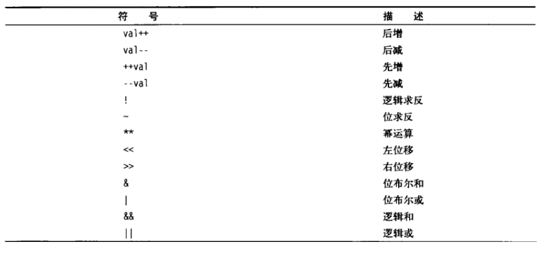

# 1 条件分支的作用

- 整数判断大小
- 字符串的判断
- 文件判断

# 2 命令的格式

- 单分支

  ```shell
  if condition; then
  	statement1;
  	statement2;
  	# ......
  fi	
  ```

- 双分支

  ```shell
  if condition; then
  	statement1;
  	statement2;
  	# ......
  else
  	statement3;
  	statement4;
  fi
  ```

- 多分支

  ```shell
  if condition1; then
  	statement1;
  	statement2;
  	# ......
  elif condition2; then
  	statement3;
  	statement4;
  	# ......
  elif condition3; then
  	statement5;
  	statement6;
  	# ......
  	
  	# ......
  else 
  	statement7;
  	statement8;
  	# ......
  fi
  ```

# 3 condition条件的格式

- [ exp ] 括号两边有空格
- [[ exp ]] 括号两边有空格
- (( exp ))  或 let exp
- test exp

# 4 test命令

用于检测条件是否成立，可以进行数值，字符串和文件的测试，一般与if连用

- 数值测试选项

  - -eq 等于
  - -ne 不等于
  - -gt 大于
  - -le 大于等于
  - -lt 小于
  - -le 小于等于

  test 返回的是布尔值，可以使用下面的命令，查看test的执行过程

  ```shell
  test 1 -eq 1 && echo equal || echo not equal
  ```

  test 1 -eq 1 返回true，因此必须再执行echo equal。当写成test 1 -eq 2 时，由于&&的短路效果，就会直接执行echo not equal

- 字符串测试选项：

  - = 等于
  - != 不等于
  - -z 长度为零
  - -n 长度不为零
  - `> 或<` ，表示字符串大于小于，使用时需要使用`\`转义，因为它会和重定向符号混淆

- 文件测试选项：

  - -e 文件存在
  - -r 文件存在且可读
  - -w 文件存在且可写
  - -x 文件存在且可执行
  - -s 文件存在且至少有一个字符
  - -d 文件存在且为目录
  - -f 文件存在且为普通文件
  - -c 文件存在且为字符型特殊文件
  - -b 文件存在且为块特殊文件

- test命令的逻辑连接词

  - -a 且
  - -o 或
  - ！非 注意和其他选项之间用空格隔开
  - 优先级依次是 ！ -a -o `-a和-o不短路`

# 5 [ ]命令

与test命令等价，除此之外它还可以用来执行运算 例如`a=1&&b=2&&echo $[a+b]`输出3

不支持算符运算符扩展，类似于判断` test '1+1==3' && echo 1||echo 3`，或`[ 1+1==3 ] && echo 1||echo 3`打印出都是1，显然是不对的

# 6 [[ ]]关键字

这是一个关键字，不是命令。它与如下作用：

- [[ ]] 结构比[ ]结构更加通用。在[[和]]之间所有的字符都不会发生文件名扩展或者单词分割，但是会发生参数扩展和命令替换。
- 支持字符串的模式匹配，使用=~操作符时甚至支持shell的正则表达式。字符串比较时可以把右边的作为一个模式，而不仅仅是一个字符串，比如[[ hello == hell? ]]，结果为真。[[ ]] 中匹配字符串或通配符，不需要引号。
- 使用[[ ... ]]条件判断结构，而不是[ ... ]，能够防止脚本中的许多逻辑错误。比如，&&、||、<和> 操作符能够正常存在于[[ ]]条件判断结构中(不需要转义就可以直接使用)，但是如果出现在[ ]结构中的话，会报错。比如可以直接使用if [[ \$a != 1 && \$a != 2 ]], 如果不适用双括号, 则为if [ \$a -ne 1] && [ \$a != 2 ]或者if [ \$a -ne 1 -a ​\$a != 2 ]。
- [[ ]]可以使用&& || ！作为逻辑连接词，且支持短路操作 

# 7 (( ))和let命令

let和(())可以对整数进行计算，可以计算整数算术表达式，比较大小，支持运算符扩展(可以做`let 1+1==2`)等的判断，只要表达式符合C语言规范（甚至三目运算符和逻辑表达式都可以），都可以用let或(())来计算，注意：

- 当表达式中含有特殊字符，类似于<,>,|等，需要使用单引号或双引号引起来，不然会出错，例如`let 1+2>3 && echo 4 ||echo 0`打印4，而`let "1+2>3" && echo 4 ||echo 0`打印0，显然前者不是我们需要的
- let和(())都可以一次性计算多个表达式，并且以最后一个表达式的值作为整个 let 命令的执行结果，但是let使用空格分隔，(())使用逗号分隔
- (()) 的效率高
- (())与[]命令相似，可以与$搭配使用，可以引用[]或(())的结果，并且(())中的变量引用可以不加\$.
- (( ))不需要再将表达式里面的大小于符号转义，除了可以使用标准的数学运算符外，还增加了以下符号：



# 8 相似命令

1. ()

   小括号的作用是命令组，可以把多个命令，在一个新的shell中执行，括号中的命令格式：

   `(command1;command2;......commandn)`

   此外还可以与\$连用做<font color="red">命令替换</font>的功能，格式`$(cmd)`，shell会在执行命令之前，先把命令中包含的`$(cmd)`执行一遍，得到其标准输出，再将此输出放到原来命令。有些shell不支持，如tcsh。  反单引号 也可以起到同样的效果，格式 :\`cmd`

   除此之外，小括号还可以用来初始化数组 格式`array=(1,2,3)`

2. {}

   大括号的作用：

   - 扩展，可以扩展字符串，例如输出`echo msg{1,2,3,4,5}.txt` ，就会打印出，msg1.txt msg2.txt msg3.txt msg4.txt msg5.txt，使用...表示顺序列表，例如`$ echo {1..5}`就会输出1 2 3 4 5，还可以嵌套使用，例如：`echo {ex{1..3},ex4}.sh`，会输出：ex1.sh ex2.sh ex3.sh ex4.sh

   - 代码块，可以把几个命令包起来一起执行，格式`{ cmd1;cmd2;......cmdn;}`，第一个命令与大括号之间有一个空格，每一条命令之后都要有分号；与小括号的命令组不同，大括号包起来的命令称为内部组，这个结构事实上创建了一个匿名函数，大括号内的命令不会新开一个子shell运行，即脚本余下部分仍可使用括号内变量

   - 变量替换

     与\$连用，可以组成`${变量名}`,可以把变量的值替换在这个地方，一般来说，`${a}`与`$a` 是一样的，但是在某些情况下，使用大括号可以避免歧义，例如

     ```shell
     a='hello '
     echo $aworld
     ```

     我们需要的是\$a和world拼接起来的结果，但是shell会以为我们要引用变量\$aworld，此时我们只需`${a}world `，来规定引用的变量名称范围。
     
   - 模式匹配

     - 第一种模式：

       ${variable%pattern}，这种模式时，shell在variable中查找，看它是否一给的模式pattern结尾，如果是，就从命令行把variable中的内容去掉右边最短的匹配模式

     - 第二种模式：

       ${variable%%pattern}，这种模式时，shell在variable中查找，看它是否一给的模式pattern结尾，如果是，就从命令行把variable中的内容去掉右边最长的匹配模式

     - 第三种模式：

       ${variable#pattern} 这种模式时，shell在variable中查找，看它是否一给的模式pattern开始，如果是，就从命令行把variable中的内容去掉左边最短的匹配模式

     - 第四种模式：

       ${variable##pattern} 这种模式时，shell在variable中查找，看它是否一给的模式pattern结尾，如果是，就从命令行把variable中的内容去掉右边最长的匹配模式

     这四种模式中都不会改变variable的值，其中，只有在pattern中使用了*匹配符号时，%和%%，#和##才有区别。

     variable是一个变量名，pattern是模式字符串
     
   - 字符串替换

     - `${var:-str}`，若var为空，则返回str的值，否则使用var的值
     - `${var:=str}` ，若var为空，则返回str的值，否则使用var的值，并同时把var赋值为str
     - `${var:+str}`，若var不为空，则返回str的值，否则什么也不做；
     - `${var:?str}`，若var不为空，则返回var的值，若变量var为空，则把string输出到标准错误中，从脚本中退出。我们可利用此特性来检查是否设置了变量的值。
     - 在上面替换结构中str不一定是常值的，可用另外一个变量的值或是一种命令的输出。

   - 字符串截取

     - `${str:num}`，当num大于等于0时，表示从左端第num(从0开始)个字符开始，提取到字符串末尾，当num小于0时，表示从右端开始提取(-1表示最后一个字符，-2表示倒数第二个)，提取到字符串开头
     - `${str:pos:len}`，pos表示开始的位置索引，len表示长度，从pos开始，提取len个字符
     - `${var/pattern/pattern}`表示将var字符串的第一个匹配的pattern替换为另一个pattern
     - `${var//pattern/pattern}`表示将var字符串中的所有能匹配的pattern替换为另一个pattern。    
     
     

